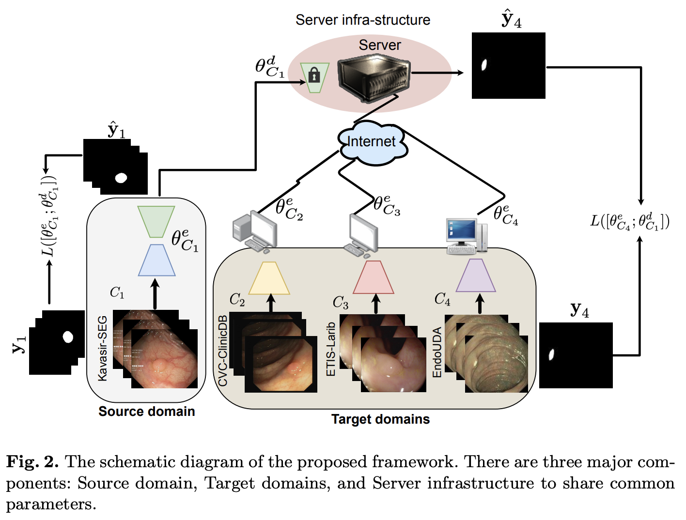
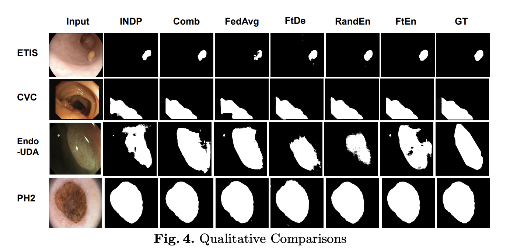

#  Client-server Deep Federated Learning for Cross-domain Surgical Image Segmentation

Official pytorch implementation of the paper **A Client-server Deep Federated Learning for Cross-domain Surgical Image Segmentation**. \
This paper presents a solution to the cross-domain adaptation problem for 2D surgical image segmentation, explicitly considering the privacy protection of distributed datasets belonging to different centers. 

<p align="center"></p>

# Prerequisites

- Python 3.8
- PyTorch 1.7.1
- CUDA 10.1

# Installation

First of all, clone the repo:
```bash
    git https://github.com/bhattarailab/federated-da.git
```
All the required python packages can be installed with:
```bash
    cd federated-da
    pip install -r requirements.txt
```


# Training

For training, first put training images and corresponding segmentation maps in separate directories and update the train.py file as required.


Then start training with the following command:

```bash
    python3 train.py
```


# Results

<p align="center">Qualitative comparison between the proposed method with its baseline methods.
</p>

# Citation
```bash
@article{subedi2023client,
  title={A Client-server Deep Federated Learning for Cross-domain Surgical Image Segmentation},
  author={Subedi, Ronast and Gaire, Rebati Raman and Ali, Sharib and Nguyen, Anh and Stoyanov, Danail and Bhattarai, Binod},
  journal={arXiv preprint arXiv:2306.08720},
  year={2023}
}
```